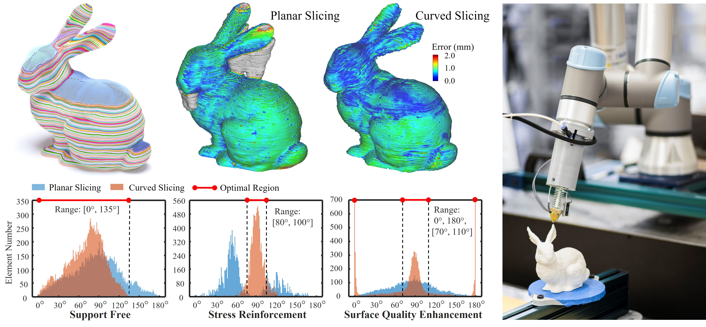
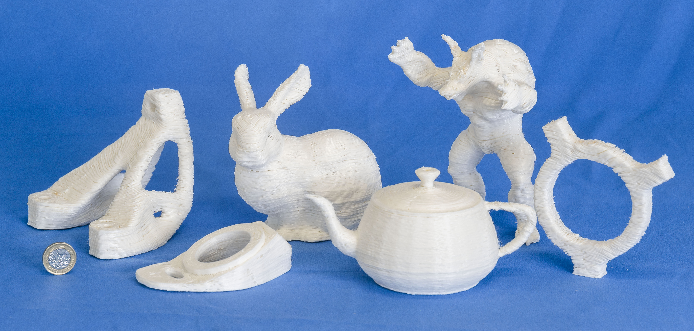

# [S^3-Slicer: A General Slicing Framework for Multi-Axis 3D Printing](https://guoxinfang.github.io/S3_Slicer) (Technical Papers' Best Paper Award)

[Tianyu Zhang](https://www.linkedin.com/in/tianyu-zhang-49b8231b5/), Guoxin Fang, Yuming Huang, Neelotpal Dutta, Sylvain Lefebvre, Zekai Murat Kilic, and [Charlie C.L. Wang](https://mewangcl.github.io/), [*ACM Transactions on Graphics (SIGGRAPH Asia 2022)*, vol.41, no.6, article no.277 (15 pages), December 2022](https://dl.acm.org/doi/10.1145/3550454.3555516)

## Abstract
Multi-axis motion introduces more degrees of freedom into the process of 3D printing to enable different objectives of fabrication by accumulating materials layers upon curved layers. An existing challenge is how to effectively generate the curved layers satisfying multiple objectives simultaneously. This paper presents a general slicing framework for achieving multiple fabrication objectives including support free, strength reinforcement and surface quality. These objectives are formulated as local printing directions varied in the volume of a solid, which are achieved by computing the rotation-driven deformation for the input model. The height field of a deformed model is mapped into a scalar field on its original shape, the isosurfaces of which give the curved layers of multi-axis 3D printing. The deformation can be effectively optimized with the help of quaternion fields to achieve the fabrication objectives. The effectiveness of our method has been verified on a variety of models. [Video Link](https://www.youtube.com/watch?v=qNm1ierKuUk)

## Installation

Please compile the code with QMake file “ShapeLab.pro”.

**Platform**: Ubuntu20.02LTS + QT-plugin-5.12 + CMake-3.24.2

**Required**:
OpenMKL Qt

**Install Steps**: 
`mkdir build && cd build`
`cmake .. && cmake --build . --target ShapeLab -j 12 && cd ShapeLab`
`./ShapeLab`

## Usage
**Step 0: Input tetrahedron mesh into the system**
Click button **Open** at the left up corner of UI. For example, **bunny_cut6** is opened.

**Step 1: Run fabrication objective-driven deformation**
Click button **1.x fabrication objective (Support free - SF, Strength reinforcement - SR, and Surface quality - SQ)** at the right side of UI. For example, **1.7 SF_SR_SQ** is enabled for **bunny_cut6** model.

**Step 2: Run inverse deformation**
Click button **2. Inverse Deformation** to resume deformed model and generate the scalar field for slicing.

**Step 3: Curved layer slicing**
Move to the next page **Slicing_Toolpath**, click button **3.0 Layer Generation (scalar)** to generate curved layers, and use **Output** to save the layers into **\DataSet\remesh_operation\layers_unremeshed**.

- **Note**: The button **3.1 Adaptive Height Slicing** is used for **AnkleBaseV1** model, the rest given model will use button 3.0.

**Step 4: Curved layer remesh**
The remesh operation is conducted by running .bat file integrated in the MeshLab.

- **Note**: The **remesh_slimmedLayer.bat** file is in **\DataSet\remesh_operation**, and the directory line should be modified. Please check this github link for more details [here](https://github.com/zhangty019/remesh_bat).

**Step 5: Toolpath generation**
Click button '**Get Tool-Path**' to generate toolpath with parameters - Width and Distance. And **Output** to save the layers and toolpath into **\DataSet\CURVED_LAYER** and **\DataSet\TOOL_PATH**.

**Step 6: Singularity-Aware Motion Planning for Multi-Axis Additive Manufacturing**
Please refer to this project [link](https://github.com/zhangty019/MultiAxis_3DP_MotionPlanning) for the G-code generation.

## Contact Information
Tianyu Zhang (tianyu.zhang-10@postgrad.manchester.ac.uk)

Guoxin Fang  (guoxin.fang@manchester.ac.uk)

Charlie C.L. Wang  (changling.wang@manchester.ac.uk)
